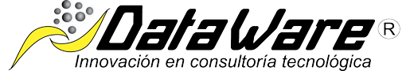

# Dataware Radio Frequency Identification Manager

<p align="center">
  
</p>


[](https://www.dataware.com.mx/)
[](https://www.dataware.com.mx/servicios-profesionales)
[](https://www.zebra.com/la/es/products/rfid.html)

## Descripción

Esta es una aplicación de trazabilidad mediante tecnología RFID que permite al usuario agregar o crear zonas y subzonas de lectura, así como portales que capturan información en tiempo real en diferentes ubicaciones. Proporciona la capacidad de leer o ver lo que los portales RFID capturan en las distintas zonas y administrar o filtrar esos datos según las necesidades específicas. Facilita la reubicación de materiales, la aplicación de filtros de calidad o el rastreo de materiales que han pasado por puntos estratégicos. Incluye una interfaz intuitiva y funciones avanzadas de administración de datos para optimizar procesos y tomar decisiones informadas con base en la información capturada de cada zona.

## Tecnologías

[](https://learn.microsoft.com/es-es/aspnet/core/?view=aspnetcore-8.0&WT.mc_id=dotnet-35129-website)
[](https://dotnet.microsoft.com/es-es/languages/csharp)
[](https://nextjs.org/)
[](https://www.typescriptlang.org/)

## Tabla de contenido

- [Instalación](#instalación)
- [Instrucciones](#instrucciones)
- [Créditos](#creditos)
- [Licencias](#licencias)


## Instalación

Para clonar el repositorio de esta aplicación y comenzar a trabajar con él, sigue los siguientes pasos:

**1.- Instalar Git y Node:** Asegúrate de tener Git instalado en tu sistema. Si no lo tienes, puedes descargarlo e instalarlo desde [aquí](https://git-scm.com/downloads).
Esta aplicación requiere Node.js y npm (el gestor de paquetes de Node). Puedes descargar e instalar ambos desde [aquí](https://nodejs.org/en). Asegúrate de instalar la versión LTS (Long Term Support) para mayor estabilidad.

Para verificar la instalación de Node.js, abre una terminal y ejecuta:
```bash
node -v
```
Para verificar la instalación de npm, ejecuta:
````bash
npm -v
````
**2.- Clonar el repositorio:** Abre una terminal o línea de comandos y ejecuta el siguiente comando para clonar el repositorio.

***Nota:** Se recomienda clonar el frontend en una carpeta y el backend en otra carpeta. Esto para tener mejor control sobre los dos entornos y poder utilizar **Visual Studio Code para Front** y **Visual Studio para el Back**.*

```bash
git clone https://github.com/EmmanuelDataware/RFIDM.git
```

**3.- Navegar al directorio del repositorio:** Una vez completada la clonación, navega al directorio del repositorio recién clonado usando el comando cd.

```bash
cd RFIDM
```
**4.- Instalar dependencias:** Instala todas las dependencias necesarias para ejecutar la aplicación.

```bash
npm install
```
**5.- Instalación y Configuración de SQL Server Management Studio (SSMS)**
SQL Server Management Studio (SSMS) es una herramienta gráfica para gestionar bases de datos SQL Server. A continuación se detallan los pasos para instalar y comenzar a usar SSMS en tu entorno local:

*Requisitos Previos*
- Windows 10 o superior: SSMS solo está disponible para sistemas operativos Windows.
- .NET Framework 4.7.2 o superior: Asegúrate de tener instalada la versión requerida de .NET Framework. Puedes descargarla desde [aquí](https://dotnet.microsoft.com/es-es/download/dotnet-framework).

**5.1- Descargar el instalador:** Descarga la última versión de SQL Server Management Studio desde la página oficial de Microsoft en [este enlace](https://learn.microsoft.com/en-us/sql/ssms/download-sql-server-management-studio-ssms?view=sql-server-ver16).

**5.2- Ejecutar el instalador:** Una vez descargado el instalador, haz doble clic en el archivo .exe para iniciar el proceso de instalación.
Sigue las instrucciones del asistente de instalación. Selecciona la ubicación de instalación y acepta los términos de la licencia.
Una vez completada la instalación, haz clic en "Close" para finalizar el proceso.
- Abre SQL Server Management Studio desde el menú de inicio de Windows.
- Conectar al servidor:
- En la ventana "Connect to Server", selecciona el tipo de servidor **(Database Engine)**.
- Ingresa el nombre del servidor. Si estás utilizando una instancia local, puedes usar localhost o '.'
- Selecciona el método de autenticación. Para una instalación local, generalmente se usa "Windows Authentication", pero en este caso debe de ser por medio de **"SQL Server Authentication"** con **usuario sa** y una **clave de acceso.** Este usuario y clave después se pondrán en un archivo llamado **appsettings.json**

***Nota:** No requieres crear ninguna base de datos aparte, la migración se hace desde el backend por medio de **EntityFramework** y este crea una base de datos llamada **RFID**.*


**6.- Ejecutar la aplicación:** Una vez instaladas las dependencias y configurado el entorno, ejecuta la aplicación con el comando adecuado. 

#### Para el Frontend debes usar el siguiente comando:
```bash
npm run dev
```
#### Para el Backend puedes usar el botón de inicio de proyecto.
Debes de buscar el archivo ***"appsettings.json"*** en la carpeta de ***"CleanArchitecture.Api"*** para cambiar la siguiente línea por el **Data Source de tu SQL Server**, el **usuario** para el cual se recomienda **sa** y tu **contraseña**.

```bash
"DefaultConnection": "Data Source=SERVERNAME;Initial Catalog=RFID;User ID=USUARIO;Password=XXXXXXX;Encrypt=False"
```
Antes de iniciar el Backend asegurate de que en ***"Configurar proyectos de inicio"*** esté seleccionada la ocpión de **"Proyecto de inicio único"** y que tenga seleccionada la opción ***"CleanArchitecture.Api"***.

Pulsa el botón de inicio en Visual Studio, esta acción abrirá un Swagger en tu navegador.

Ahora deberías tener la aplicación corriendo en tu entorno local y lista para su uso y pruebas.

## Instrucciones

En la carpeta [**Documents**](Documents) del repositorio, se puede encontrar un documento detallado que contiene toda la información funcional del software. Este documento incluye:

- **Descripción General:** Una visión general del software, sus objetivos y sus principales características.
- **Especificaciones Funcionales:** Detalles sobre cómo se espera que funcione el software, incluyendo diagramas de flujo, casos de uso y escenarios.
- **Guías de Usuario:** Instrucciones paso a paso sobre cómo utilizar las distintas funcionalidades del software.
- **Notas de la Versión:** Historial de cambios y mejoras realizadas en cada versión del software.

#### Acceso a la Documentación

Abre el archivo de documentación, [Documentación Funcional DRIM V1.0.0](Documents/Documentación_Funcional_DRIM_V1.pdf)

Esta documentación es fundamental para entender cómo funciona el software y cómo sacarle el máximo provecho.

## Créditos
[](https://www.dataware.com.mx/servicios-profesionales)

## Licencias

La licencia utilizada para este repositorio es [MIT License](LICENSE)

---

## Guia de contribución

Proxima Implementación
